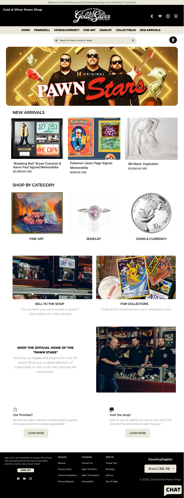

<h1 align="center">Gold & Silver Pawn Shop | E-commerce</h1>

  
   
  Página Inicial da Interface do E-commerce

Projeto acadêmico desenvolvido em equipe para a disciplina de Engenharia de Software I, com o objetivo de realizar a modelagem de um sistema de e-commerce para a empresa “Gold & Silver Pawn Shop” (Loja do Trato Feito), escolhida pelos integrantes e validada pelo professor. A empresa utilizada como referência já existe e foi selecionada para fins acadêmicos.
O projeto contempla as etapas de levantamento de requisitos, prototipação de interface, gestão de configuração de software, métricas, SCRUM e testes.

## Tecnologias e Ferramentas

[GitHub](https://github.com/)  
[Figma](https://www.figma.com/)  
[Draw.IO](https://app.diagrams.net/)  
[Lucidchart](https://www.lucidchart.com/) 

## Organização do Projeto

 `docs/requisitos/`: requisitos funcionais, não funcionais, diagramas e narrativas  
 `docs/interface/`: protótipo da interface do sistema
 `docs/metricas/`: cálculo de pontos de função e métricas  
 `docs/scrum/`: backlog, sprint e burndown chart  
 `docs/testes/`: plano e casos de testes

## Autores do Projeto

| [m0ra1s](https://github.com/m0ra1s) | [skzmeow](https://github.com/skzmeow) | 
